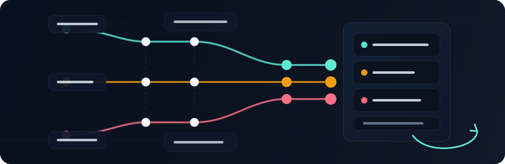

<p align="center">
  
</p>

<h1 align="center">A-Society</h1>

<p align="center">
  <strong>An agentic harness for project work.</strong>
</p>

<p align="center">
  Structured memory, role-based workflows, runtime orchestration, verification, and self-improvement.
</p>

<p align="center">
  
  = 18" src="https://img.shields.io/badge/node-%3E%3D18-F59E0B?style=flat-square">
  
  
</p>

<p align="center">
  <a href="#getting-started">Getting Started</a> |
  <a href="runtime/INVOCATION.md">Runtime Guide</a> |
  <a href="general/">Reusable Library</a>
</p>

<p align="center">
  
</p>

---

## What A Project Gets

| Structured memory | Workflow execution | Cross-project learning |
|---|---|---|
| `a-docs/` preserves roles, rules, indexes, and standing project truth across sessions. | The runtime routes work through explicit roles, handoffs, records, and closure checks. | Feedback and backward-pass findings improve universal templates and project-type standards over time. |

---

## Why It Exists

Agents are capable. The bottleneck is not capability — it is the operating environment around the agent.

Most projects are not set up in a way that agents can navigate confidently, act through a designed process, retain useful memory between sessions, or improve the project from the work they just performed. There is no declared canonical tool, no structured role boundary, no workflow authority, no durable record of decisions, and no feedback loop that turns recurring friction into better defaults. The result is inconsistency, rework, and friction — not because the agent failed, but because the project has no harness for agentic work.

This is a solvable problem. It is solved by giving the project a standing agentic harness: structured memory, role boundaries, workflow execution, verification, and self-improvement.

---

## The Core Bet

> The quality of agent output is determined more by the quality of the project's harness — its structure, workflow, memory, verification, and feedback loops — than by the capability of the agent alone.

A well-harnessed project makes a good agent reliable. A poorly harnessed project makes a great agent guess.

---

## The Standards A-Society Targets

A-Society is designed to help projects achieve three standards:

- **Comprehensive work** — touched standing surfaces are accounted for, not silently left stale
- **Cost optimization** — agents load only the context and verification burden they actually need
- **Low latency** — workflows take the shortest safe path and parallelize independent work

When these standards conflict, A-Society prioritizes them in this order:

`comprehensive work > cost optimization > low latency`

---

## What A-Society Is

A-Society is both a reusable library of project standards and an executable runtime for agentic work. It helps initialize projects, orchestrate role-based sessions, preserve handoff records, verify closure, and turn feedback from real flows into better future defaults.

It is:
- **Project-portable** — sits beside many kinds of projects without being embedded inside them
- **Domain-flexible after setup** — can support software, writing, legal, research, design, and other project work once initialized
- **Technically honest** — setup and operation currently require a technical operator or technical environment
- **Agent-adaptable** — is not conceptually bound to one model or agent platform
- **Learning across projects** — uses feedback to improve universal templates, project-type standards, runtime behavior, and initialization defaults

---

## How It Works

A-Society is a standalone repository that sits alongside your project. You initialize an `a-docs/` folder inside your project through the runtime UI, which scaffolds the compulsory surfaces and then runs an Owner-led initialization flow that fills them with project truth. After initialization, the runtime supports ongoing flows with role context, workflow routing, records, handoffs, closure checks, and improvement feedback.

```
a-society/          ← this repo (the framework)
  general/          ← reusable instructions, templates, role archetypes
  runtime/          ← executable layer, browser UI, and initialization contract
  a-docs/           ← a-society's own agent documentation

my-project/         ← your project
  [project files]
  a-docs/           ← your project's agent documentation (initialized from a-society)
```

---

## What's Inside

| Folder | Contents |
|---|---|
| `runtime/` | The executable layer — browser runtime, orchestration, context loading, records, handoffs, initialization, and improvement support |
| `general/instructions/` | How to create each agent-doc artifact for any project |
| `general/project-types/` | Reusable standards for approved project categories |
| `general/roles/` | Ready-made universal role templates and support docs, currently centered on Owner |
| `general/improvement/` | Protocols and templates for iterative doc improvement |
| `a-docs/` | A-Society's own agent documentation — a live example of the framework applied |

---

## Getting Started

### If you have an existing project

**1. Clone A-Society alongside your project**

Both should live in the same parent directory:

```
your-workspace/
├── your-project/     ← your existing project
└── a-society/        ← this repo
```

**2. Install runtime dependencies**

From the workspace root, run:

```bash
npm --prefix ./a-society/runtime install
```

**3. Start the runtime**

From the workspace root, run:

```bash
npm --prefix ./a-society/runtime start
```

The browser UI lists existing projects with `a-docs/`, existing projects without `a-docs/`, and a create-new-project path. On first use, configure and activate a model in Settings before starting project work.

Choose your existing project. If it does not yet have `a-docs/`, the runtime scaffolds the compulsory files and then starts an Owner initialization flow that reads the project, asks only what it cannot infer, and fills the scaffolded files.

**4. Done**

Once approved, your project has a structured agent harness. Any agent you assign a role to can load context from `a-docs/`, follow the project's workflow, and preserve useful memory as work moves forward.

---

### If you are starting from scratch

You do not need a finished project to use A-Society. A rough idea is enough to start.

**1. Clone A-Society into your workspace**

```
your-workspace/
└── a-society/        ← this repo
```

**2. Install runtime dependencies**

From the workspace root, run:

```bash
npm --prefix ./a-society/runtime install
```

**3. Start the runtime**

```bash
npm --prefix ./a-society/runtime start
```

Configure and activate a model in Settings before starting project work.

**4. Create the project in the UI**

Choose `Create New Project`, enter the project name, and let the runtime create the project folder and scaffold the compulsory `a-docs/`.

The runtime then starts an Owner initialization flow. The Owner asks the startup questions interactively, fills the scaffolded files with real project truth, and leaves you with a usable first-pass `a-docs/`.

**5. Improve as you go**

Your `a-docs/` reflects where your project is today. As your vision sharpens, your `a-docs/` sharpens with it. Backward-pass analysis and optional upstream feedback turn completed work into better project memory and better A-Society defaults. You do not need a complete project to get value from the framework — every session builds on the last.

---

*Prefer to build manually? The instruction library is in [`general/instructions/`](general/instructions/).*
